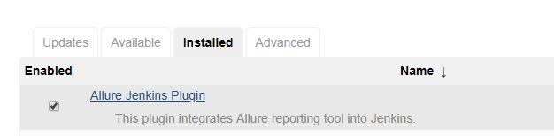
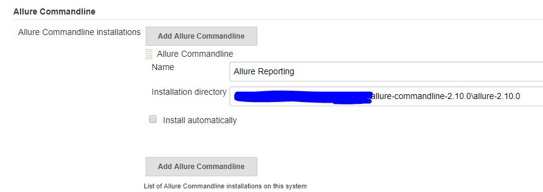
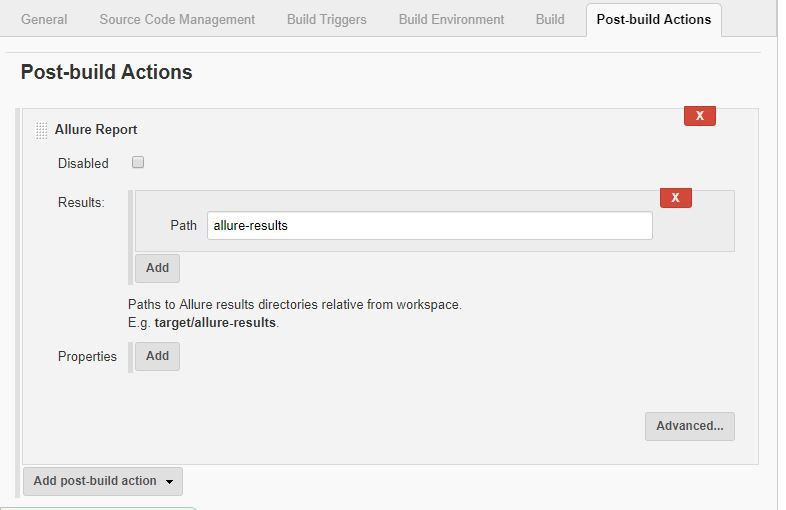

# Install and configure Allure report

* Allure binary can be downloaded from https://github.com/allure-framework/ to add to external libraries

* Extract and the bin path to be added to system env variables

* In command prompt, to verify allure version > `allure --version`

* Run the selenium project and refresh the folder in eclipse workspace, a new folder named as **allure-results** should have been created

* To open the allure report, From cmd prompt run > `allure serve \path to project root>\allure-results>`

* Dependency to be added to pom.xml if the project is Maven based,
```xml
<dependency>
   <groupId>io.qameta.allure</groupId>
   <artifactId>allure-testng</artifactId>
   <version>2.10.0</version>
</dependency>
```

# Allure Report Annotations

* @Description("This is the test case to validate successful login")
* @Severity(SeverityLevel.BLOCKER)
* @Step    

# To integrate allure reporting to Jenkins:		

* To integrate allure reporting to Jenkins, please install 'Allure' plugin to jenkins,
    - Jenkins Homepage > Manage Jenkins > Manage Plugins > 'Allure' from available plugins
        
    
* Jenkins Homepage > Global Tool Configurations > Click on the **Allure CommandLine Installation**, specify any preferred name and then provide the Allure installation home path,
    

* In the projects's post build action add allure reporting
    

## Allure setup for selenium-java-cucumber project

* Dependency to be added
```xml
<!-- https://mvnrepository.com/artifact/io.qameta.allure/allure-cucumber4-jvm -->
<dependency>
    <groupId>io.qameta.allure</groupId>
    <artifactId>allure-cucumber4-jvm</artifactId>
    <version>2.10.0</version>
</dependency>
```

* Below TestRunner class to be added for cucumber and the tests to be run from here,
```java
package testRunner;
import cucumber.api.CucumberOptions;
import cucumber.api.testng.AbstractTestNGCucumberTests;
@CucumberOptions(features= "src/test/java/features/",
    glue="stepDefinitions", 
	plugin = { "pretty", "html:target/cucumber-html-reports", "io.qameta.allure.cucumber4jvm.AllureCucumber4Jvm",
	          "json:target/cucumber-html-reports/cucumber.json"}, monochrome = false)
		public class TestRunner extends AbstractTestNGCucumberTests {
		}
```

## Allure reporting for **webdriverio** project

* Reference - https://webdriver.io/docs/allure-reporter.html
	
* Install webdriverio allure report using below package.json command,
		`@wdio/allure-reporter": "^5.7.11"`

* Corresponding config to be added to **wdio.conf.js** is,
		
```json
reporters: [['allure', {
outputDir: 'allure-results',
disableWebdriverStepsReporting: false,
disableWebdriverScreenshotsReporting: false,
}]]
```
Steps reporting and screenshots inclusion can be modified by updating the accessors as 'true'
		
* To access, generate and open the allure report install this command line tool,
		* `npm install -g allure-commandline --save-dev`

* Generate and open Allure report using the below commands,
		1. <this is to run the test cases> `node_modules\.bin\wdio wdio.conf.js --spec ./test/specs/loginTest.spec.js`
		2. <this is to generate the report> `node_modules\.bin\allure generate allure-results/ --clean && node_modules\.bin\allure open`
	
* This can be  done via package.json 'scripts' as below,
```json
"report:generate": "allure generate allure-results/ --clean",
"report:open": "allure open"
```		
Run using >>> `npm run report`
	
* When we use **node_modules\.bin\allure open** a webserver will start to render the report. So its better to keep it running in a separate cmd instance and refresh the report using **http://<url>/index.html**

* Using the report API: https://github.com/webdriverio-boneyard/wdio-allure-reporter
		
```js
import reporter from '@wdio/allure-reporter'
    describe('Login Check', () => {
    it('To Login', () => {        
	reporter.addFeature("Feature1")
	reporter.addDescription("This is the test to validate login")
```

# Code Snippets

### Take screenshot when failure happens (http://total-qa.com/advanced-selenium/allure-reporting/)
```java
	@Attachment(value = "Screenshot of {0}", type = "image/png")
	public byte[] saveScreenshot(String name, WebDriver driver) {
		return (byte[]) ((TakesScreenshot) driver).getScreenshotAs(OutputType.BYTES);
	}

	public void run(IHookCallBack iHookCallBack, ITestResult iTestResult) {
		iHookCallBack.runTestMethod(iTestResult);
		if (iTestResult.getThrowable() != null) {
			this.saveScreenshot(iTestResult.getName(), driver);
		}
    }
```

# AspectWeaverj configuration
* AspectweaverJ to be configured in pom.xml for all annotations of allure report to work properly, below is a sample,

```xml
</plugin>	        
        <plugin>
            <groupId>org.apache.maven.plugins</groupId>
            <artifactId>maven-surefire-plugin</artifactId>
            <version>3.0.0-M3</version>
            <configuration>
            <suiteXmlFiles>
                <suiteXmlFile>testng.xml</suiteXmlFile>
            </suiteXmlFiles>
            <argLine>
                -javaagent:"${settings.localRepository}/org/aspectj/aspectjweaver/1.9.4/aspectjweaver-1.9.4.jar"
            </argLine>
            <properties>
                <property>
                    <name>listener</name>
                        <value>io.qameta.allure.testng.AllureTestNg</value>
                    </property>
                </properties>
            </configuration>
        <dependencies>
            <dependency>
                <groupId>org.aspectj</groupId>
                    <artifactId>aspectjweaver</artifactId>
                    <version>1.9.4</version>
                </dependency>
            </dependencies>        
        </plugin>
    </plugins>
```